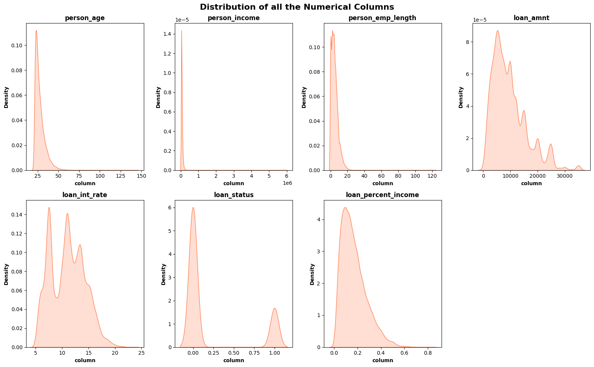
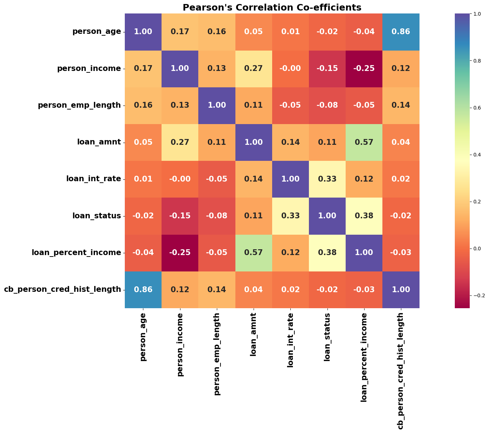
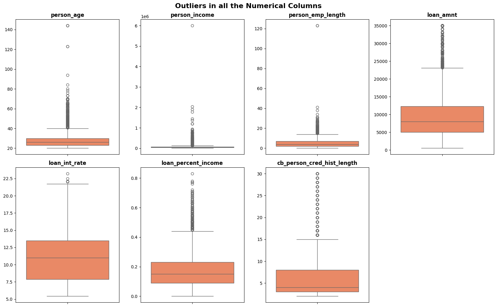
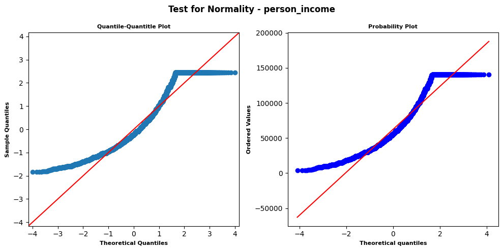
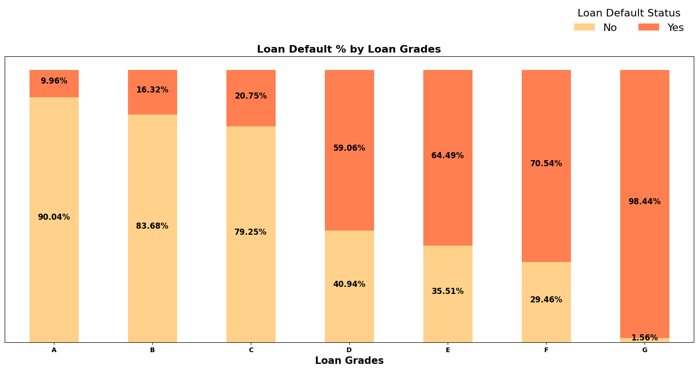
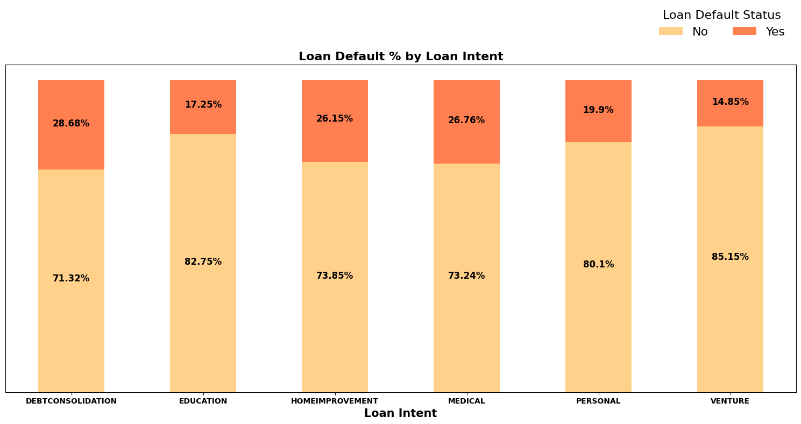
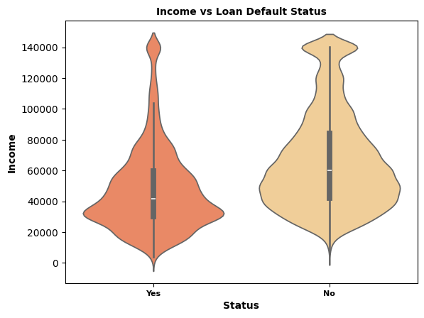
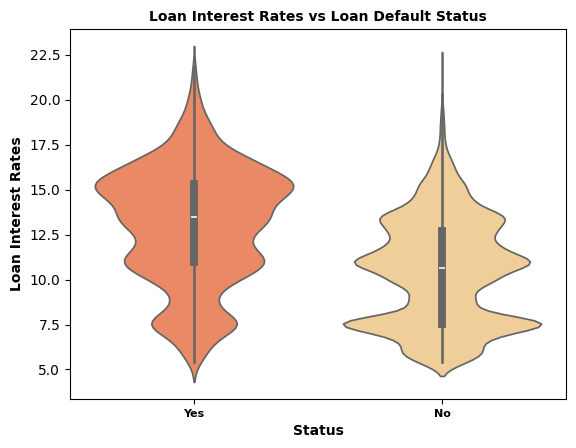
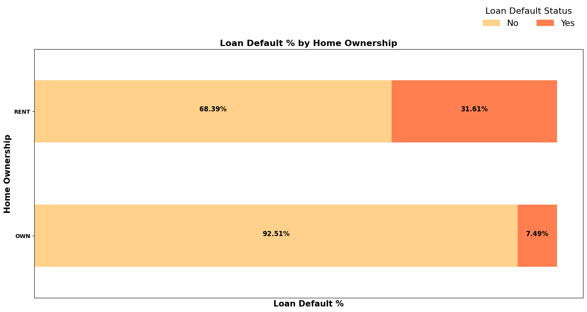
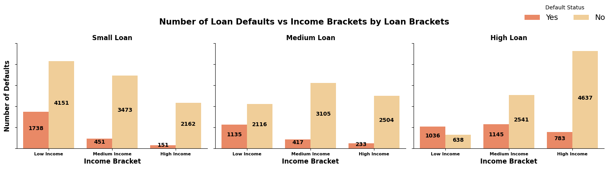

# Credit Risk EDA

**Statistical Analysis of 32K Loan Applications**

## Project Overview:

This project explores credit risk patterns across 32,000 loan applicants using statistical hypothesis testing, segmentation logic, and audit-safe data preprocessing — without relying on machine learning. The goal is to uncover actionable insights for underwriting teams and risk analysts.

---

## Dataset:

- **Source**: [Kaggle Credit Risk Dataset](https://www.kaggle.com/datasets/laotse/credit-risk-dataset)
- **Size**: 32,000 rows
- **Features**: Applicant demographics, loan details, credit history, repayment status

---

## Analytical Approach:

Key steps include:

- **Null & Outlier Handling**: Median imputation by loan grade, IQR-based capping  
- **Distribution Diagnostics**: KDE plots, Q-Q plots, Anderson-Darling tests  
- **Segmentation**: Income and loan amount discretized into quantiles  
- **Hypothesis Testing**:
  - Chi-Squared Test for categorical relationships
  - Mann-Whitney U Test for non-parametric numeric comparisons
  - CLT reasoning applied where appropriate
 
---

## Business Questions Answered:

- Does age group affect default risk?
- Which loan intents carry highest default risk?
- Does loan grade reflect default risk?
- Do renters default more than homeowners?
- Is there an income difference between defaulters and non-defaulters?
- Does low income + high loan combo increase risk?
- Do higher interest rates correlate with default?
- Does loan-to-income ratio affect default risk?

---

## Key Visualizations:

- **Numerical Columns Data Distribution**  
  

- **Correlation Heatmap**  
  

- **Box Plots for Outlier Detection**  
  

- **Normality Test (Q-Q + Probability Plot)**  
  

- **Loan Default % by Loan Grade**  
  

- **Loan Default % by Loan Intent**  
  

- **Income vs Loan Default Status**  
  

- **Loan Interest Rate vs Default Status**  
  

- **Loan Default % by Home Ownership**  
  

- **Loan Default Count by Income + Loan Bracket**  
  

---

## Strategic Takeaways:

- **High-risk flags**: Medical intent, Grades E–G, renters, income < ₹35K, interest rate > 12%, loan-to-income ratio > 0.4  
- **Safe zones**: Grade A, Venture intent, homeowners, income > ₹45K  
- **Underwriting recommendation**: Apply stricter scrutiny to flagged combinations

---

## Tools Used:

- Python: `pandas`, `numpy`, `seaborn`, `matplotlib`, `scipy`, `statsmodels`
- Jupyter Notebook

---

## Next Steps:

- Convert notebook into a Streamlit or Power BI dashboard  
- Package results into a stakeholder-facing report

---
